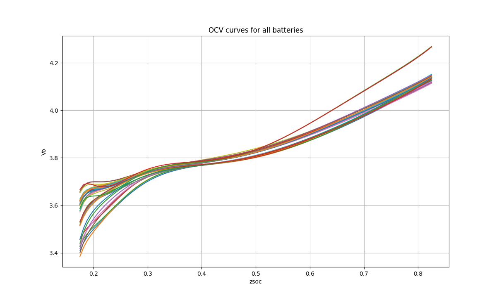
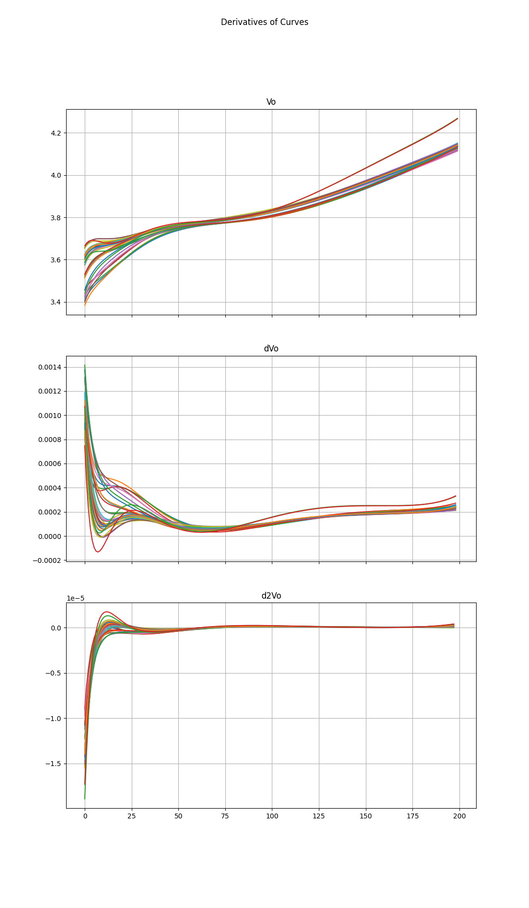
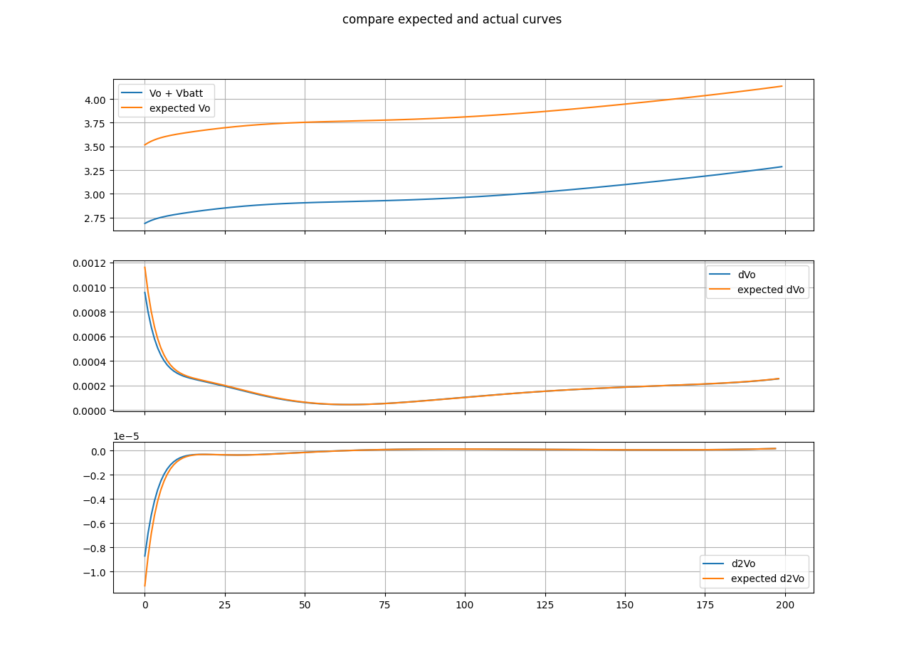
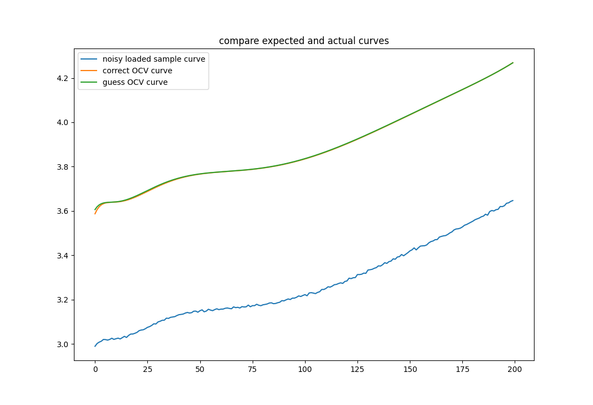
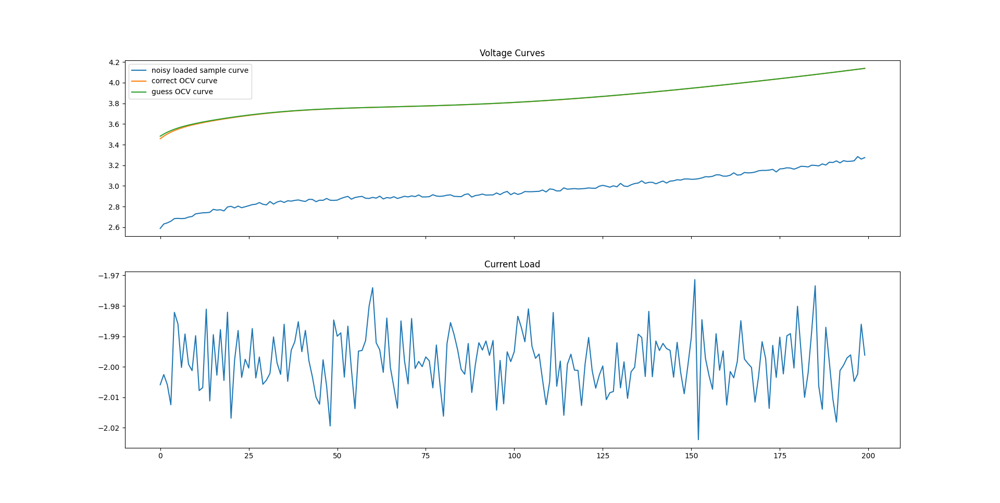
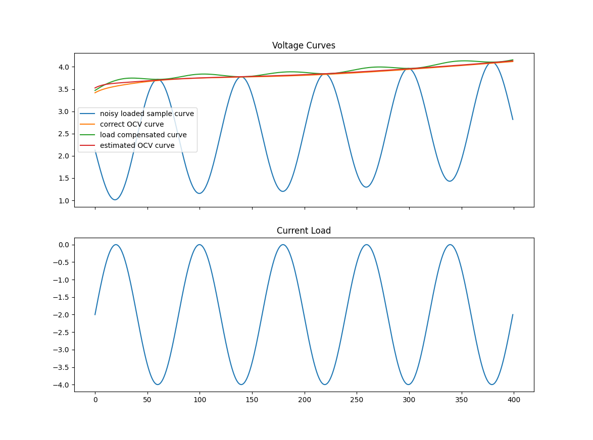

# CloudBFG implelmentation

This is a cloud-based AI implementation of an SoC characterization algorithm.

Initial meeting notes can be found [here](notes.md).

Test dataset is available [here](https://kilthub.cmu.edu/articles/dataset/eVTOL_Battery_Dataset/14226830), from Carnegie Mellon University.

## TODO

- Curve fitting is not efficient as it is now, it will need to be redone eventually using least squares, rather than a cache.
  - This will be *fourth generation* estimation
- SOC estimation needs to be done in a more efficient way. Right now, it generates the whole OCV curve and then looks up the current terminal voltage in that table. We need to be able to do a calulcation just from the current voltage, knowing R0 and the eight k-parameters.

## OCV Curves

The first version of the CloudBFG estimation algorithm will use a cache of pre-computed OCV curves.

For each of the batteries recorded in the [data](res/K_para.csv), the following OCV curve is generated, for use in estimating the K parameters of real batteries:



## Curve Fitting

Acceptable accuracy is 90% or more

### First Generation Estimation (completed)

- [x] start by generating the curves for each of the sample k parameters using zsoc.py
- [x] Generate a full discharge curve (no noise) for a battery with matching k parameters to the sample curves
- [x] look up the OCV curve for the battery with matching k parameters to the sample curves

- The guess can be using Vo from the simulator, for a perfect-match test case, as a proof of concept

#### Results

Since this is ideal-case, as soon as estimation was working, it was 100% accurate.

### Second Generation Estimation (completed)

- Second generation fitting will be done with noisy Vout curves
- This means that curve fitting will happen on the samples first, and then the clean curves will be compared to the sample set

#### The Process

I calculate the first and second derivatives, to try to fit based on rate of change of the cell potential. Below are the curves for all samples, with the first derivative and second derivative curves.

```py
# plot curves and derivatives for the sample battery
fig, ax = plt.subplots(3, 1, sharex=True)
for battery in batteries:
    ax[0].plot(battery['Vo'])
    ax[1].plot(battery['dV'])
    ax[2].plot(battery['dV2'])

ax[0].title.set_text('Vo')
ax[1].title.set_text('dVo')
ax[2].title.set_text('d2Vo')
fig.suptitle('Derivatives of Curves')
ax[0].grid(True)
ax[1].grid(True)
ax[2].grid(True)
plt.show()
```



#### First Attempt

- Taking the first and second derivatives of each OCV curve and comparing to the first and second derivatives of the sample is going to be the first attempt
- Going to account for voltage sag, but not noise

##### Results:

- The results are not perfect, but it is correct about half the time and is close to the correct answer when it isn't correct
- Looking at the results, it is clear that derivatives will be the best way to see if curves can be overlayed



```txt
expected Kbatt:  [-1.3313, 28.2101, -4.8784, 0.5292, -0.0247, -18.9233, 37.9843, -0.27]
actual Kbatt:    [-0.9741, 30.3903, -5.2017, 0.5596, -0.0259, -21.3917, 41.5533, -0.3517]
```

<sub>*This result is using a Model=1 BattSim with voltage sag, but no noise</sub>

#### Second Attempt

- I am going to try a metric where I subtract the sample and target curves, and calculate how consistent the distance between the curves are. 
  - This does essentially the same thing as the first attempt's dV derivative metric, but should help account for noise, where dV does not account for noise
  - It is being tested because, though it may not be scaleable, it may be computationally faster than noise removal/curve fitting and is worth trying

##### Results:

- correctness: 87.8%
  - note that this is the number of times it got k-parameters PERFECT, so its 'wrong' choices were still *very* close
- Changed the search metric used to subtract the sample from each target curve and integrate them, to get the area where the curves do not overlap. A shorter sum is better; pick the closest one



```txt
expected Kbatt:  [-4.4256, 83.6175, -14.0185, 1.4878, -0.0678, -64.5844, 118.3224, -0.8474]
actual Kbatt:    [-4.4256, 83.6175, -14.0185, 1.4878, -0.0678, -64.5844, 118.3224, -0.8474]
```

#### Third Attempt

- [x] do testing to determine an actual accuracy %
- [x] start introducing more noise into the curves until the accuracy starts to drop
- [x] Introduce some current noise? still do a full 1C discharge, but with slight noise, so the curves can no longer be perfect matches

##### Results:

- The accuracy has dropped to about 70%, with sigma_i and sigma_v noise being 10<sup>-2</sup>
- Looking at the actual curve comparisons, the estimated OCV curves are still pretty close to the actual OCV curves
- As of this third attempt, all of the features of Gen 2 estimation have been accomplished. Moving to Gen 3



### Third Generation Estimation (ongoing)

- Third generation will be where we start changing current throughout the discharge, since it will be rare that we will have a full, constant discharge curve.
- This means that outputs will have both sag noise, and voltage noise.
- The possiblity of calculating R0 is now introduced, since model 1 testing should see a linear scale in voltage drop based on current draw

#### First Attempt

- Start by creating a non constant current load, for instance, oscillating between 1C and 2C. See how this affects the OCV curve estimation
- Using Model 1 data, create an estimation of R0
  - Once R0 is known, we can use it to estimate an OCV curve for a loaded discharge curve
  - This unloaded discharge curve will be used to estimate the K parameters of the battery, using Gen 2 estimation

##### Results:

- Estimated R0 using least square estimation
- Results saw an average error of 1.8%, which I consider accurate enough to be used in the next generation of estimation

A sine wave was used to simulate a non-constant current load, and the OCV curve was estimated using the loaded discharge curve and the estimated R0. From this OCV curve, the K parameters were estimated.

```txt
K error : 1.05%
R0 error : 1.79%
```



### Fourth Generation Estimation (untouched)

- Incomplete curves will hopefully be able to be used, since it will be rare that a full discharge curve will be available.
- This generation can be where using linalg.lstsq is used to estimate the K parameters of the battery, as this is how Bala does it.
- Starting from a known SOC (perhaps 100%), use the coulomb counting method to collect Vout and Iout data. This will be used to estimate the K parameters of the battery.
- Estimations will need a way to be verified

## R0 Estimation

R0 estimation is done using least squares estimation, `I*R0 + 1*Vo = Vbatt`. Knowing only I and Vbatt, we can estimate R0 and Vo.

## SOC Estimation

- The SOC estimation will need to be computationally simple and memory efficient if it is to be used in a real-time system
- Just as with curve fitting, SOC estimation will be developed in stages
- Since R0 estimation is working, we can account for voltage sag in the SOC estimation

### First Generation: Table Lookups

- Generate the full OCV-SOC curve, and then look up the SOC for each voltage point.
- This method is simple and easy, but it is not memory efficient, and takes time to generate the full curve

### Second Generation: Mathematically

- Since we know the full algorithm for OCV curve generation, if we know Vo and k, we can estimate the SOC mathematically and instantly

The full equation is:

```txt
V = k0 * 1 + k1 * 1/soc + k2 * soc + k3 / soc ^ 2 + k4 / soc ^ 3 + k5 / soc ^ 4 + k6 * ln(soc) + k7 * ln(1 - soc)
```
